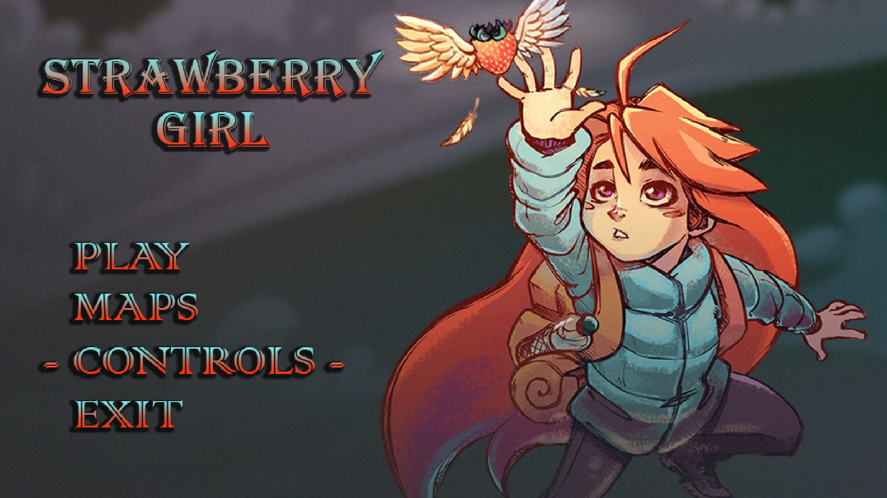

# > Strawberry Girl <

 Embark on a delightful puzzle adventure with 'Strawberry Girl'! Inspired by the classic game 'Block Dude', this game follows a brave girl on a mission to capture a    scrumptious strawberry. To succeed, you must navigate through a series of intricate mazes by moving blocks around to clear a path. But watch out for tricky obstacles    that may stand in your way! Can you help Strawberry Girl overcome these challenges and reach her tasty reward? Play now and test your puzzle-solving skills!

# > Developers <

   Diogo Pinto Araújo - University of Minho

# > Info Block Dude < 

   Block Dude is a classic puzzle game originally released for the TI-83 graphing calculator in 1994. The objective of the game is to navigate a character named Block      Dude through a series of increasingly difficult rooms by moving blocks and climbing ladders.

   The game consists of 11 levels, each with multiple rooms. In each room, the player must move blocks around to create a path for Block Dude to reach the exit. Block      Dude can push and pull blocks, as well as climb ladders and jump from certain heights.

   As the game progresses, new challenges are introduced, such as enemies that must be avoided or defeated, switches that activate doors or move blocks, and blocks with    special properties, such as being immune to gravity or explosive.

   The game's simple yet challenging gameplay and clever level design made it a hit among TI-83 users and it has since been ported to various other platforms, including    mobile devices and web browsers.

## > Contributing <

   Pull requests are welcome. For major changes, please open an issue first
to discuss what you would like to change.

